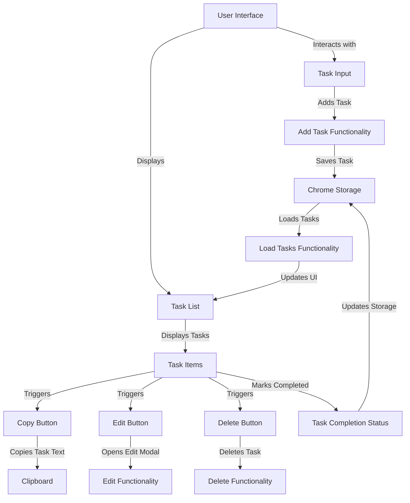

```mermaid
graph TD;
    A[User Interface] -->|Interacts with| B[Task Input];
    A -->|Displays| C[Task List];
    B -->|Adds Task| D[Add Task Functionality];
    D -->|Saves Task| E[Chrome Storage];
    C -->|Displays Tasks| F[Task Items];
    F -->|Triggers| G[Copy Button];
    F -->|Triggers| H[Edit Button];
    F -->|Triggers| I[Delete Button];
    G -->|Copies Task Text| J[Clipboard];
    H -->|Opens Edit Modal| K[Edit Functionality];
    I -->|Deletes Task| L[Delete Functionality];
    E -->|Loads Tasks| M[Load Tasks Functionality];
    M -->|Updates UI| C;
    F -->|Marks Completed| N[Task Completion Status];
    N -->|Updates Storage| E;

```