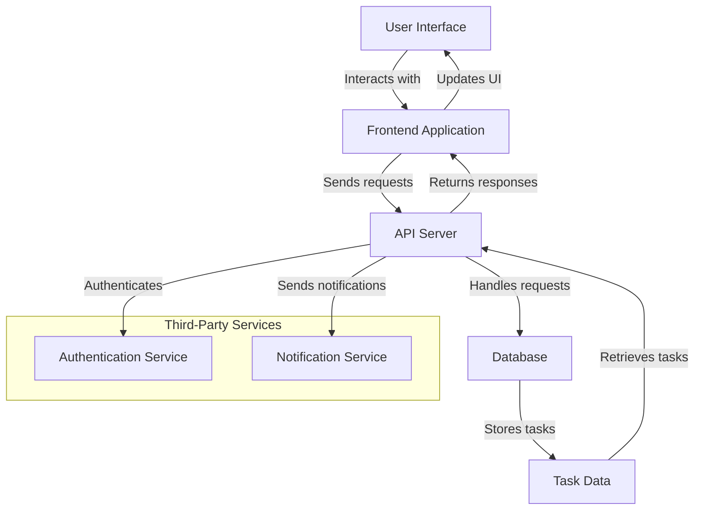

```mermaid
graph TD;
    A[User Interface] -->|Interacts with| B[Frontend Application];
    B -->|Sends requests| C[API Server];
    C -->|Handles requests| D[Database];
    D -->|Stores tasks| E[Task Data];
    E -->|Retrieves tasks| C;
    C -->|Returns responses| B;
    B -->|Updates UI| A;
    subgraph Third-Party Services
        F[Authentication Service]
        G[Notification Service]
    end
    C -->|Authenticates| F;
    C -->|Sends notifications| G;
```